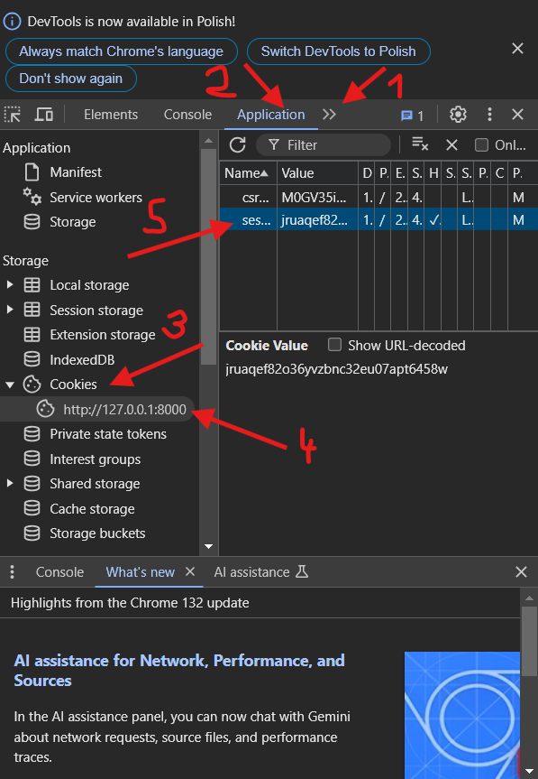
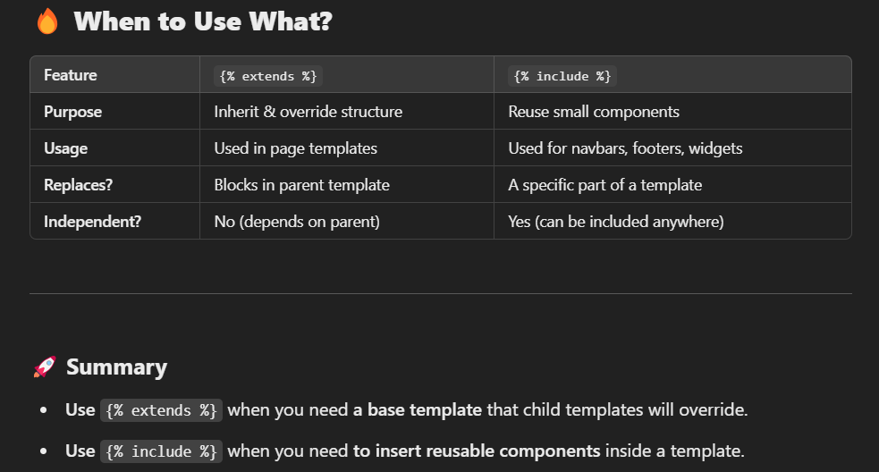
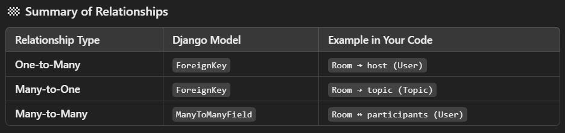
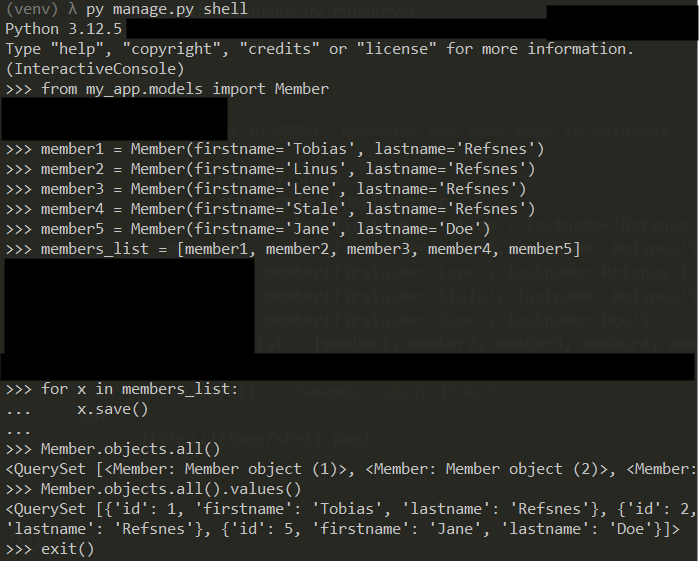

### Create Project

1. Create a directory, copy path
2. Open terminal, paste path (or open in CMDer here)
3. py -m venv venv
4. venv/Scripts/activate.bat
5. pip install django
6. pip freeze > requirements.txt
7. django-admin startproject my_django `# Short, simple name, gonna change later`
8. cd my_django
9. py manage.py runserver `# Check if works`
10. http://127.0.0.1:8000/ 
11. django-admin startapp my_app

-----------------------------------------------------------------------------------------------------------

### First Steps

1. Create my_app.urls.py and write
```
from django.urls import path
from . import views

urlpatterns = [
    path('', views.home),
]
```
2. Write in my_app.views.py:
```
from django.shortcuts import render
from django.http import HttpResponse


def home(request):
    return HttpResponse("Welcome Home")
```
3. Add in settings.py in INSTALLED_APPS = [:
```
'my_app.apps.MyAppConfig'
```
4. Go to default urls (my_django/urls.py) and add:
```
from django.contrib import admin
from django.urls import path, include


urlpatterns = [
    path('admin/', admin.site.urls),
    path('', include('my_app.urls')),
]
```

-----------------------------------------------------------------------------------------------------------

### Templates

1. Make new directory "templates" (plural) and dont place him in apps or base project, just before them (there where manage.py)
2. Make new directory "templates" (plural) in my_app, then make dir "my_app"
3. Create template.navbar.html and write:
```
<a href='/'>
    <h1>LOGO</h1>
</a>

<hr>
```
4. Create template.main.html and write:

(also set all h2 into 50px)
```
<style>
h2 {
   font-size: 50px;
}
</style>

<!DOCTYPE html> 
<html>

<head>
    <meta charset='utf-8'>
    <meta http-equiv='X-UA-Compatible' content='IE=edge'>
    <title>DjangoTM</title>
    <meta name='viewport' content='width=device-width, initial-scale=1'>
     <link rel='stylesheet' type='text/css' media='screen' href='main.css'> 
     <script src='main.js'></script> 
</head>

<body>
    

    
    


    
</body>
</html>
```
5. Create my_app.templates.my_app.home.html and write:
```




<h1>Home Template</h1>


```
6. Go to settings to bind this template, go to line where are templates
```
'DIRS': [
            BASE_DIR / 'templates'
        ],
```
7. Go to app.views
```
def home(request):
    return render(request, 'home.html')
```
8. Description 

navbar.html --> main.html

main.html --> everywhere u want.html

-----------------------------------------------------------------------------------------------------------

### for loop in home.html

1. views.py
```
rooms = [
    {'id': 1, 'name': 'Python'},
    {'id': 2, 'name': 'Java'},
    {'id': 3, 'name': 'JS'}
]

def home(request):
    context = {'rooms': rooms}
    return render(request, 'my_app/home.html', context)
```
2. home.html
```
<div>
    <div>
        
        <div>
            <h5>{{room.id}} -- {{room.name}}</h5>
        </div>
        
    </div>
</div>
```

-----------------------------------------------------------------------------------------------------------

### Clickable Pagination

1. my_app.urls.py
```
from django.urls import path
from . import views

urlpatterns = [
    path('', views.home, name="home"),
    path('room/<str:pk>/', views.room, name="room")
]
```
2. views.py
```
def room(request, pk):
    room = None
    for i in rooms:
        if i['id'] == int(pk):
            room = i
    context = {'room': room}
    return render(request, 'my_app/room.html', context)
```
3. home.html
- Static
  - (+) easier to understand
  - (-) if 1 url adress change you need to change everywhere
```




<h1>Home Template</h1>

<div>
    <div>
        
        <div>
            <h5>{{room.id}} -- <a href="/room/{{room.id}}">{{room.name}}</a></h5>
        </div>
        
    </div>
</div>


```
- Dynamic
  - (-) harder to understand
  - (+) you don't need care about name changes
```




<h1>Home Template</h1>

<div>
    <div>
        
        <div>
            <h5>{{room.id}} -- <a href="">{{room.name}}</a></h5>
        </div>
        
    </div>
</div>


``` 

-----------------------------------------------------------------------------------------------------------

### Database - First Steps
- models.Model
- migrations
- createsuperuser
- /admin site, testing new features

1. models.py
```
class Room(models.Model):
    name = models.CharField(max_length=200)
    description = models.TextField(null=True, blank=True)
    updated = models.DateTimeField(auto_now=True)
    created = models.DateTimeField(auto_now_add=True)
    
    def __str__(self):
        return self.name
```
2. admin.py
```
from .models import Room

admin.site.register(Room)
```
3. python manage.py makemigrations app
4. python manage.py migrate
5. python manage.py createsuperuser
6. Register
7. python manage.py runserver
8. Go /admin site, log in and add something (area for testing new features)

-----------------------------------------------------------------------------------------------------------

### There is - how to check if I'm logged in

Inspect current localhosted website



-----------------------------------------------------------------------------------------------------------

### Difference between 
- 
- 

 

-----------------------------------------------------------------------------------------------------------

### Relationships
- One-to-Many
  - One User (host) can be assigned to multiple Room objects.
  - But each Room can have only one host.
- Many-to-One
  - Many Room objects can share the same Topic
  - Each Room belongs to only one Topic.
- Mant-to-Many
  - A single Room can have many Users (participants).
  - A single User can participate in multiple Rooms.

 

-----------------------------------------------------------------------------------------------------------

### Upgrade of models.py

1. models.py
```
from django.db import models
from django.contrib.auth.models import User


class Member(models.Model):
    firstname = models.CharField(max_length=100)
    lastname = models.CharField(max_length=100)


class Topic(models.Model):
    name = models.CharField(max_length=200)

    def __str__(self):
        return self.name


class Room(models.Model):
    topic = models.ForeignKey(Topic, on_delete=models.SET_NULL, null=True)
    host = models.ForeignKey(User, on_delete=models.SET_NULL, null=True)
    name = models.CharField(max_length=200)
    description = models.TextField(null=True, blank=True)
    participants = models.ManyToManyField(User, related_name='participants', blank=True)
    updated = models.DateTimeField(auto_now=True)
    created = models.DateTimeField(auto_now_add=True)

    class Meta:
        ordering = ['-updated', '-created']

    def __str__(self):
        return self.name


class Message(models.Model):
    user = models.ForeignKey(User, on_delete=models.CASCADE)
    room = models.ForeignKey(Room, on_delete=models.CASCADE)
    body = models.TextField()
    updated = models.DateTimeField(auto_now=True)
    created = models.DateTimeField(auto_now_add=True)

    class Meta:
        ordering = ['-updated', '-created']

    def __str__(self):
        return self.body[:50]
```
2. admin.py
```
from django.contrib import admin
from .models import Room, Topic, Message

admin.site.register(Room)
admin.site.register(Topic)
admin.site.register(Message)
```
3. python manage.py makemigrations app
4. python manage.py migrate
5. python manage.py runserver

-----------------------------------------------------------------------------------------------------------

### Python in CMDer, manually add some data to database

1. py manage.py shell
2. from app.models import Member
3. member1 = Member(firstname='Tobias', lastname='Refsnes')
4. member2 = Member(firstname='Linus', lastname='Refsnes')
5. member3 = Member(firstname='Lene', lastname='Refsnes')
6. member4 = Member(firstname='Stale', lastname='Refsnes')
7. member5 = Member(firstname='Jane', lastname='Doe')
8. members_list = [member1, member2, member3, member4, member5]
9. for x in members_list:
10. x.save() `# remember about indent`

 

-----------------------------------------------------------------------------------------------------------

### Python Changes in database via CMDer

1. Update
- py manage.py shell
- from members.models import Member
- x = Member.objects.all()[4]
- x.firstname
- x.firstname = "Stalikken"
- x.save() `# remember about parentheses - "()"`
- Member.objects.all().values()
2. Delete
- py manage.py shell
- from members.models import Member
- x = Member.objects.all()[2]
- x.delete()
- Member.objects.all().values()
3. Insert
- py manage.py shell
- from members.models import Member
- x = Member.objects.all()[0]
- x.phone = 666123987
- x.joined_date = '2025-03-08'
- `x.__dict__`
- x.save() `# It will not save untill phone is not a part of Model Member`
- Member.objects.all().values()

-----------------------------------------------------------------------------------------------------------

### Simple adding image into my website

1. Create static.images.my_logo.png, there where manage.py
2. settings.py
```
STATIC_URL = 'static/'

STATICFILES_DIRS = [
    os.path.join(BASE_DIR, 'static')
]
```
3. navbar.html
```


<a href='/'>
    <h1>
        LOGO
        
        LOGO
    </h1>
</a>

<hr>
```
The **alt** attribute in an HTML tag stands for alternative text. It provides a textual description of the image in case the image cannot be displayed for any reason.

-----------------------------------------------------------------------------------------------------------

### ImageField (Typical Backend)

```
image = models.ImageField(upload_to='item_images', blank=True, null=True)
```
- Django model is used for storing image files in your database and handling file uploads. Whether or not you need it depends on your application requirements. Here is a breakdown:

- When you might need it:
  - If you want to upload images (such as product images, profile pictures, etc.) via your Django app, you should use ImageField.
  - upload_to='item_images': Specifies the folder inside your MEDIA_ROOT directory where uploaded images will be stored. In this case, it's item_images.
  - blank=True: Allows the image field to be optional (you can leave it blank when creating or updating an instance of the model).
  - null=True: Allows the field to store NULL values in the database (no image uploaded).

1. settings.py
```
MEDIA_URL = 'media/'
MEDIA_ROOT = BASE_DIR / 'media'
```
2. models.py
```
class Member(models.Model):
    image = models.ImageField(upload_to='item_images', blank=True, null=True)
    firstname = models.CharField(max_length=100)
    lastname = models.CharField(max_length=100)
```
3. normal urls.py (my_django.urls.py)
```
from django.contrib import admin
from django.urls import path, include
from django.conf.urls.static import static
from django.conf import settings

urlpatterns = [
    path('admin/', admin.site.urls),
    path('', include('my_app.urls')),
] + static(settings.MEDIA_URL, document_root=settings.MEDIA_ROOT)
```

-----------------------------------------------------------------------------------------------------------

### SignupForm - register, forms.py

1. Sign up in forms.py
```
from django import forms
from django.contrib.auth.forms import UserCreationForm
from django.contrib.auth.models import User

class SignupForm(UserCreationForm):
    class Meta:
        model = User
        fields = ('username', 'email', 'password1', 'password2')
```
